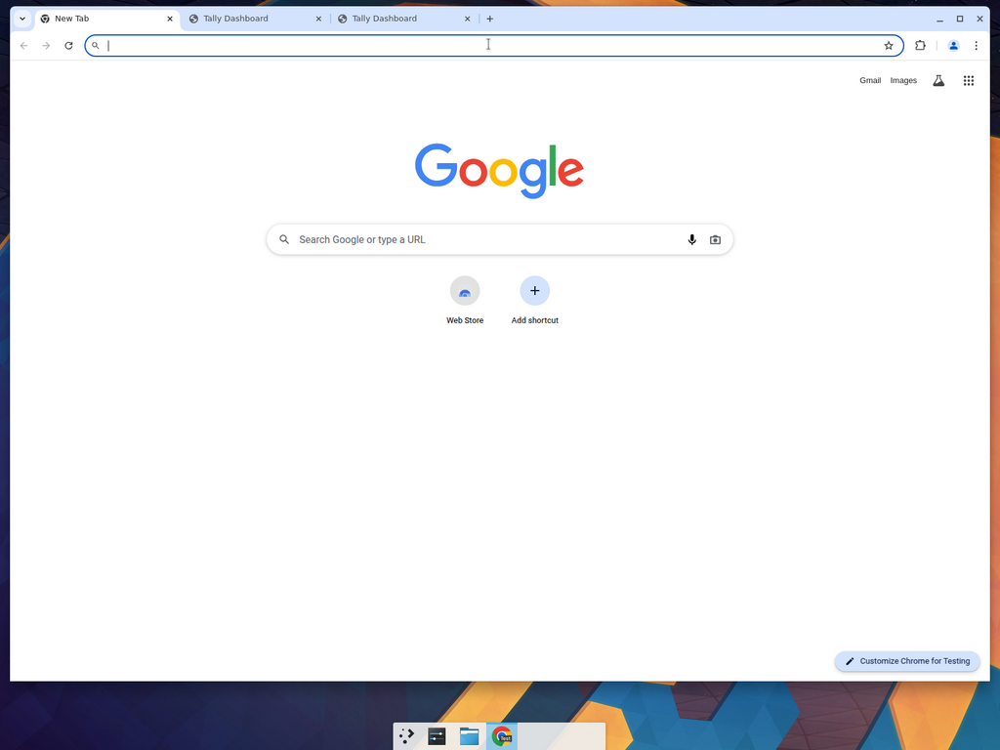

# Tally Dashboard

A self-hosted Power-BI–style dashboard for **TallyPrime / Tally ERP 9**. Runs
locally on the same machine as Tally, connects to the **Tally HTTP/XML
Gateway** (ODBC Server) on port `9000`, and visualises your company's data:

- KPI overview (Sales, Purchases, Receivables, Payables, Cash & Bank, Stock)
- Sales & purchase trends (12-month)
- Top customers & suppliers
- Stock summary
- Receivables / payables aging
- Day Book (recent vouchers)
- Ledger explorer with search
- Profit & Loss, Balance Sheet, Trial Balance

When Tally isn't reachable the app transparently falls back to a bundled
demo dataset so you can explore the UI immediately.



## Stack

- **Backend** — FastAPI (Python 3.12, `uv`), talks XML over HTTP to the Tally
  gateway, exposes a clean JSON API at `http://localhost:8787`.
- **Frontend** — React + TypeScript + Vite + Tailwind, charts by Recharts, at
  `http://localhost:5173`.

## Quick start

### Option A — one-command script (recommended)

**Windows** (PowerShell or double-click):

```powershell
.\start.ps1
```

Or double-click **`start.bat`** in File Explorer. Opens two terminal windows
(backend + frontend) and launches `http://localhost:5173` in your default
browser.

**macOS / Linux**:

```bash
./start.sh
```

Either script installs dependencies on first run, then starts the FastAPI
backend on `:8787` and the Vite dev server on `:5173`. Open
<http://localhost:5173>.

### Option B — Docker Compose

```bash
docker compose up --build
```

Dashboard at <http://localhost:5173>, API at <http://localhost:8787>.

### Option C — run services manually

```bash
# Backend (Python 3.12+, uv)
cd backend
uv sync
uv run uvicorn app.main:app --port 8787

# Frontend (Node 22+)
cd frontend
npm install
npm run dev
```

## Connecting to Tally

1. Open **TallyPrime** (or Tally ERP 9) on the machine where your books live.
2. Press `F1` → **Settings** → **Connectivity** → **Client/Server configuration**.
3. Set **TallyPrime acts as** to `Both`, and **Port** to `9000`.
4. Accept. Keep TallyPrime running.
5. Verify the gateway by visiting <http://localhost:9000> in a browser — you
   should see *"TallyPrime Server is Running"*.
6. In the dashboard, open **Settings**, enter `http://localhost:9000`, click
   **Test**. The header badge should turn green and show your company name.

The dashboard URL is persisted in your browser (`localStorage`); the backend
can also be pointed at a default Tally instance via the `TALLY_URL`
environment variable.

### Running the dashboard on a different machine

If the dashboard runs on a machine other than the Tally host, set **Tally URL**
in **Settings** to the Tally host's LAN address, e.g. `http://192.168.1.50:9000`.
Ensure Tally's port `9000` is reachable from that machine.

## API

FastAPI auto-generated docs live at <http://localhost:8787/docs>.

| Endpoint              | Purpose                                            |
|-----------------------|----------------------------------------------------|
| `GET /api/health`     | Liveness probe                                     |
| `GET /api/connection` | Test connection to Tally (latency, company name)   |
| `GET /api/dashboard`  | Everything the main dashboard needs in one payload |
| `GET /api/ledgers`    | All ledgers with opening / closing balances        |
| `GET /api/trial-balance` | Trial Balance rows                              |
| `GET /api/profit-loss`   | Profit & Loss                                   |
| `GET /api/balance-sheet` | Balance Sheet                                   |

Every endpoint accepts an `X-Tally-Url` header to override the Tally target
per request (that's how the in-app Settings page works).

Responses look like:

```json
{
  "data": { ... },
  "used_live_data": true
}
```

`used_live_data: false` means the demo dataset was returned — either Tally
was unreachable or returned an unexpected response.

## Project layout

```
tally-dashboard/
├── backend/                  FastAPI service
│   ├── app/
│   │   ├── api/routes.py     REST routes
│   │   ├── tally/            XML gateway client + parsers + mock data
│   │   ├── config.py
│   │   ├── main.py
│   │   └── models.py         Pydantic schemas shared with frontend
│   └── pyproject.toml
├── frontend/                 React + Vite + Tailwind
│   └── src/
│       ├── components/
│       ├── pages/
│       ├── hooks/
│       └── lib/
├── docker/                   Dockerfiles for each service
├── docker-compose.yml
└── start.sh
```

## Extending

- Add a new XML request envelope in `backend/app/tally/requests.py` and a
  parser in `backend/app/tally/parser.py`.
- Expose it from `backend/app/tally/service.py` and wire a route in
  `backend/app/api/routes.py`.
- Add a matching type in `frontend/src/lib/types.ts`, an API call in
  `frontend/src/lib/api.ts`, and render it in a page under
  `frontend/src/pages/`.

## License

MIT
